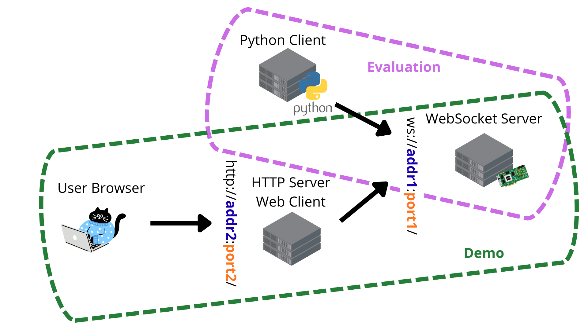

Usage
=====

The package is based on a WebSocket client-server interaction. The server waits for connections
by the clients. The clients can send configurations messages in JSON format (e.g. to specify
the input/output desired language) and audio chunks, encoded as 16-bit integers. The server
processes the input audio and sends to the client JSONs which contain the transcript/translation
generated by the configured speech processor. In addition, if configured to do so, the server
writes logs that can be used to compute metrics in a JSONL file.

To have everything up and running, first run the server and once the server is up and running
execute one or more clients. The repository contains the code for two types of clients: a web
interface client that can be used for demos and a python command-line client that can be used
for evaluation of the speech processor performance.

Below, you can find a simple illustration of the overall architecture with the two scenarios:

Server
______

Run the WebSocket server with YAML configuration files::

    simulstream_server --server-config config/server.yaml \
                       --speech-processor-config config/speech_processor.yaml

The repository contains examples of YAML files both for the server and for some speech processors.
They can be edited and adapted.

Customize with Your Speech Processor
------------------------------------

If you want to implement your own ``speech_processor``, you need to create a subclass
of ``simulstream.server.speech_processors.SpeechProcessor`` and add the class
to the ``PYTHONPATH``. Then reference the new class in the YAML file configuration
of the speech processor. Refer to the dedicated documentation for more
details on how to implement a speech processor in :doc:`generated/simulstream.server.speech_processors.base`.

You can also check the examples of speech processors available in the repository as a reference
for your implementation. Notice that each speech processor can have additional dependencies that
are not installed by default with this codebase (see :doc:`installation`).

Web Client
__________

For a demo, you can create an HTTP web server that servers a web interface interacting with the
WebSocket server. This can be done by::

    simulstream_demo_http_server --config config/server.yaml -p 8001  --directory webdemo

In case you are not running the command from the root folder of this repository, you should change
accordingly the ``--directory`` parameter to point to the ``webdemo`` folder containing the HTML
files of the HTTP demo. You can of course replace ``8001`` with any other port number you prefer.
The web interface can then be accessed from the local laptop at ``http://localhost:8001/`` or from
any other terminal connected  to the same network using the IP address of your workstation instead
of ``localhost``. Be careful not to use the same port specified for the WebSocket server if they
are running on the same machine. If running the HTTP server from a machine different from the one
where the WebSocket server runs, ensure that the HTTP server can connect to the WebSocket server
through the address specified in the ``config/server.yaml`` file.

Python Client
_____________

If you want to score your system on a set of audio files (e.g. a test set), send the audios for
processing with the provided client::

    simulstream_wavs_client --uri ws://localhost:8080/ \
        --wav-list-file PATH_TO_TXT_FILE_WITH_A_LIST_OF_WAV_FILES.txt \
        --tgt-lang it --src-lang en

Tne ``--uri`` should contain the address of the WebSocket client, so it should correspond to what
is specified in the server YAML config. The file specified in ``--wav-list-file`` should be a TXT
files containing for each line the path to a WAV file.

Before running the command, ensure that the logging of metrics is enabled in the configuration file
of the WebSocket server (i.e., ``metrics.enabled = True``) and that metrics are logged to an
empty/non-existing file, to ensure that the resulting file will contain only the logs related to
the files sent by the client. Then, compute the relevant scores as described below
(`Evaluation`_).

Evaluation
__________

To evaluate your system, take the JSONL file written by the server after the execution of the
Python client (e.g. ``metrics.jsonl``) and run::

    simulstream_score_latency --scorer stream_laal \
        --eval-config config/speech_processor.yaml \
        --log-file metrics.jsonl \
        --reference REFERENCE_FILE.txt \
        --audio-definition YAML_AUDIO_REFERENCES_DEFINITION.yaml

    simulstream_score_quality --scorer comet \
        --eval-config config/speech_processor.yaml \
        --log-file metrics.jsonl \
        --references REFERENCES_FILE.txt \
        --transcripts TRANSCRIPTS_FILE.txt

    simulstream_stats --eval-config config/speech_processor.yaml \
        --log-file metrics.jsonl

Each of them will output different metrics. ``simulstream_score_latency`` provides the metric for
the latency of the system by leveraging a sentence-based TXT reference file and a YAML file, which
for each line in the reference TXT contains the WAV file to which it belong, its ``offset``
(i.e. start time) and ``duration``. The exact definition of how the latency is defined depends on
the selected metric (``--scorer``).

Similarly, ``simulstream_score_quality`` evaluated the quality
of the generated outputs against one (or more) reference (and transcript, only for metrics
requiring them) file(s).

Lastly, ``simulstream_stats`` computes statistics like the computational cost and flickering ratio.

